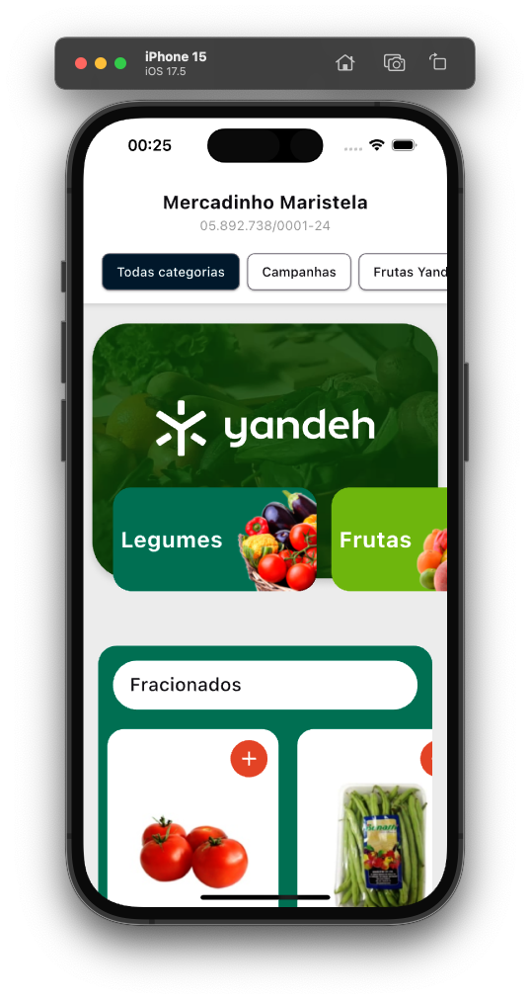
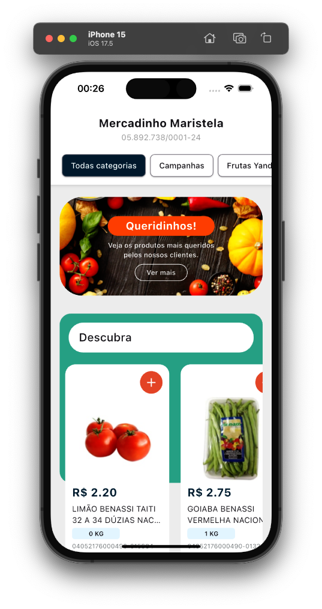
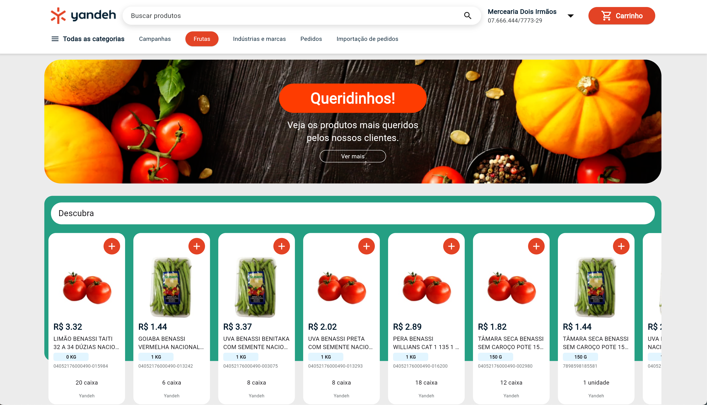

<h2 align="center">Yandeh Green Grocer<h2>
<p align="center">
    
</p>

   <h2>Topics 📋</h2>

  <p>
      
   - [About 📖](#about-)
   - [Preview 📱](#preview-)
   - [Technologies Used 👨🏽‍💻](#---technologies-used----)
   - [How to Use 🤔](#how-to-use-)
   - [Architecture](#architecture)
   </p>

   <h2>About 📖</h2>
   
   <p>
    Projeto desenvolvido para teste técnico do processo seletivo da Yandeh, e simula um app para o b2b de hortifruti e mercearias, totalmente responsivo e disponível para android, ios e web.
   </p>

---

   <h2>Preview 📱</h2><br>

   <p a>
     
     
     
   </p>

---

 <h2>
   Technologies Used 👨🏽‍💻
   </h2>
   
- **bloc** -> Gerenciador de estado.
- **dio** -> Pacote de rede para efetuar requisições http.
- **dio_cache_interceptor** -> Interceptador de cache HTTP Dio com múltiplos armazenamentos.
- **bloc_test** -> Biblioteca utilizada para testes unitários do bloc.
- **mocktail** -> Pacote utilizado para criar mocks para os testes unitários do bloc.

---

 ## Architecture

  <p>
Ao decidir a arquitetura para o projeto, optei por implementar a Clean Architecture, utilizando as camadas de Data, Domain e Presentation, pois ao meu ver combina com a utilização do Flutter Bloc como gerenciador de estado. Essa escolha foi guiada pela necessidade de estruturar o código de forma modular, escalável e de fácil manutenção. Nesse projeto, optei pela utilização das 3 camadas, onde: Data: Possui todos os arquivos de repositórios, os quais fazem requisições à serviços externos como a api disponibilizada. Domain: Contém o arquivo de modelagem dos dados das entidades. Também responsável pela serialização e desserialização dos objetos. Presentation: Camada responsável por armazenar toda a parte da UI do projeto, telas e arquivos bloc. 
  </p>
   
  
---

   <h2>How to Use 🤔</h2>

```
- Clone this repository:
$ git clone https://github.com/Franciscof11/green_grocer_yandeh.git GreenGrocerYandeh

- Enter in directory:
$ cd GreenGrocerYandeh

- For install dependencies:
$ flutter pub get

- Connect your emulator or physical device

- Run the app:
$ flutter run
```

---

This project was developed by **[@Francisco Gabriel](https://www.linkedin.com/in/franciscossg/)**,
if it helped you, give ⭐, it will help me too 😉.

---

   <div>

[](https://www.linkedin.com/in/franciscossg/)

   </div>

